# DayToDayApp

**DayToDayApp with** 
- Spring Boot 
- CRUD pattern
- REST API
- h2

# Database (h2)

데이터베이스로 h2 를 사용했습니다.

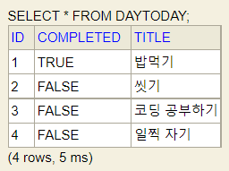

현재 들어있는 데이터 기본값입니다.

 

# View
## main page
 

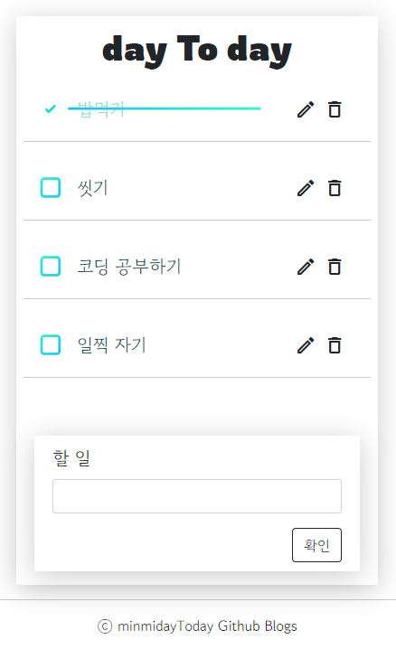

기본적인 CRUD 패턴과 REST api 를 구현하기 위해    
view 페이지를 하나로 표현했습니다.

## create

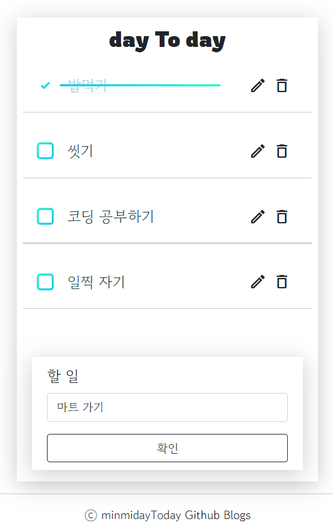
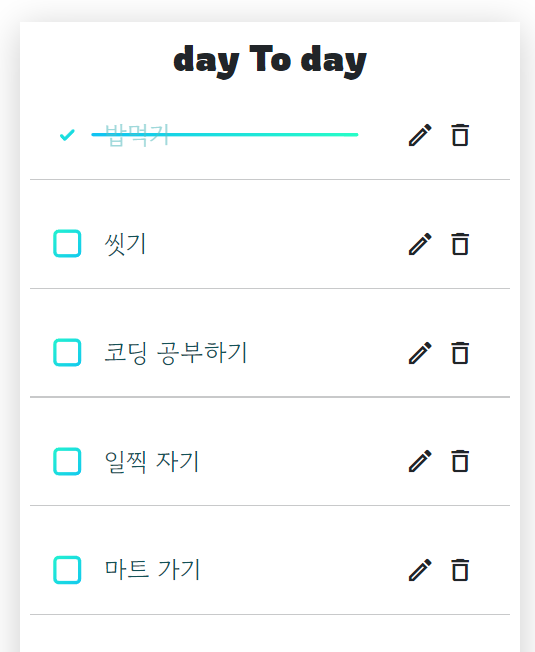

할 일을 입력하고 확인 버튼을 누르면   
새로운 할 일이 등록됩니다.

 
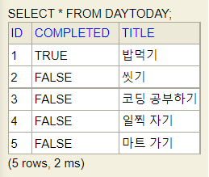

h2 db 와 연동되어 데이터가 바로 적용됩니다.

## update

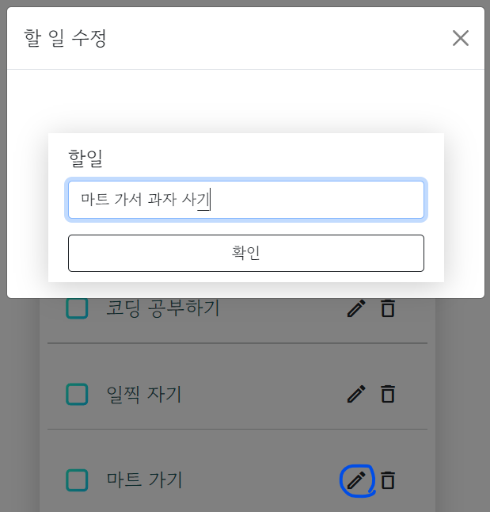
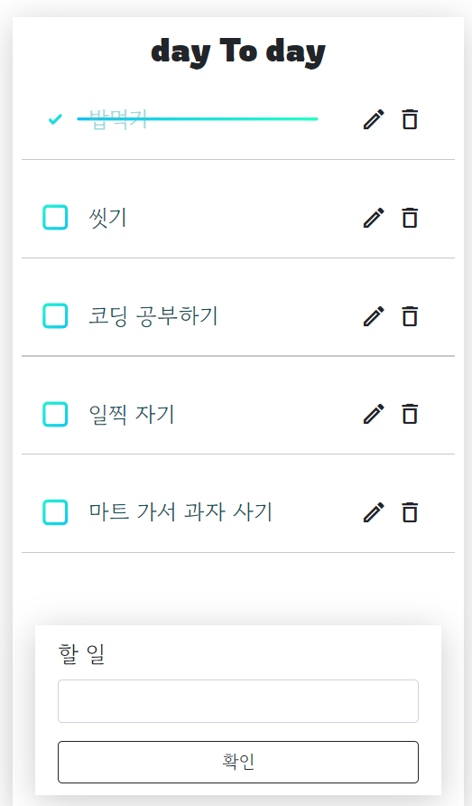

할 일을 입력하고 수정 버튼(연필모양) 을 누르면   
할 일이 수정됩니다.

 
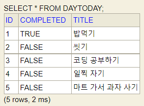

h2 db 와 연동되어 데이터가 바로 적용됩니다.

## delete

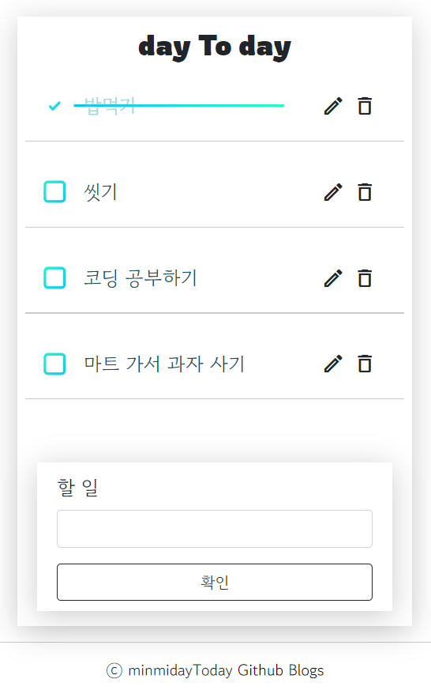

삭제 버튼을 누르면 별도의 알람 없이   
바로 삭제됩니다.

 
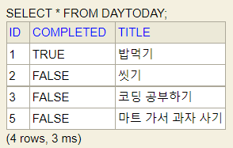

h2 db 와 연동되어 데이터가 바로 적용됩니다.

## check box

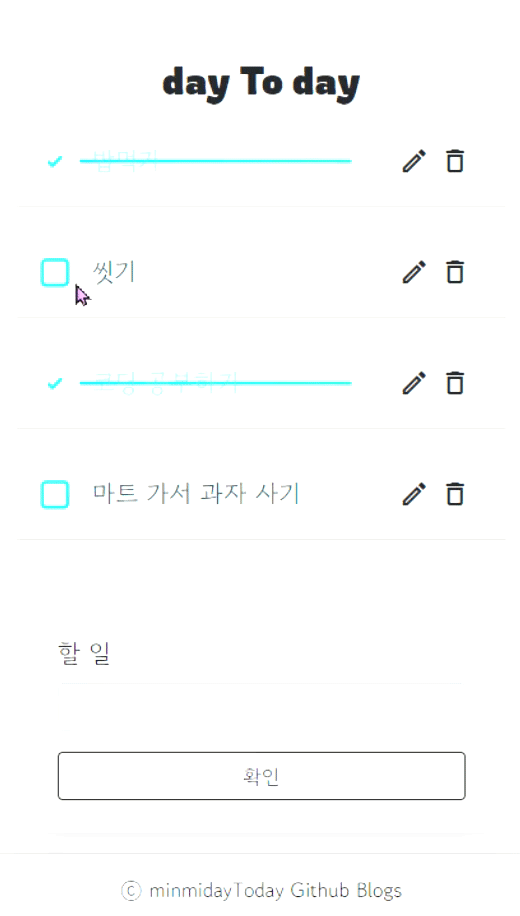

체크박스를 누르면 할 일을 완료할 수 있습니다.

 
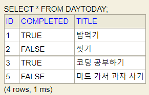

h2 db 와 연동되어 데이터가 바로 적용됩니다.   
이때, check box (컬럼COMPLETE) 는 boolean 값입니다.

# Reference
https://codepen.io/shshaw/pen/WXMdwE